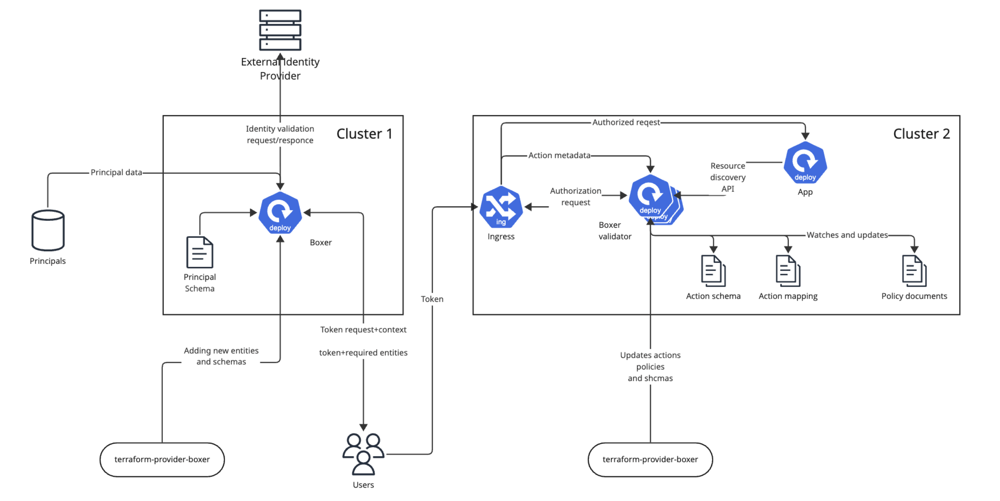

# Introduction

Boxer Authorization (AuthZ) API with AWS Cedar-based policy evaluation JWT-based authorization and authentication
for applications.

Learn more about Cedar: https://www.cedarpolicy.com/en

The purpose of this project is to provide a flexible and extensible integration layers for different OIDC providers
and authentication schemas, allowing applications to leverage the power of AWS Cedar for fine-grained policy-based
access control integrated with the modern IaC instruments and practices.

# Usage

## Quickstart

See [docs/quickstart.md](docs/quickstart.md) for a quickstart guide to get you up and running with the Boxer
Authorization API.

## Project architecture



The project is based on pluggable microservices architecture, which allows utilizing authorization with different
schemas and protocols.

The project structure is as follows:

### boxer-issuer (this repository)

- Responsible for managing AWS Cedar entities, token issuance, validating external tokens, managing external identities.

### boxer-validator-nginx

https://github.com/SneaksAndData/boxer-validator-nginx

- An Nginx-based authorization and authentication validator that can be used as a sidecar or standalone service.
- Responsible for validating incoming requests based on the policies defined in AWS Cedar and the tokens issued by the
  boxer-issuer.

### boxer-core

https://github.com/SneaksAndData/boxer-core

- A core library that provides common functionalities for both the issuer and validator, such as token management,
  policy evaluation, and integration with AWS Cedar.

### terraform-provider-boxer

https://github.com/SneaksAndData/terraform-provider-boxer

- A Terraform provider that allows managing AWS Cedar policies and entities as code, enabling seamless integration with
  modern infrastructure management practices.

# Integration testing

To run integration tests, you need to set up a test environment with the following:

```shell
$ docker-compose up -d
```

To obtain an external token for testing, you can use the following command:

```shell
$ curl \
  -d "client_id=test_client" \
  -d "client_secret=test_client_secret" \
  -d "username=test_user" \
  -d "password=test_user_password" \
  -d "grant_type=password" \
  "http://localhost:8080/realms/master/protocol/openid-connect/token"
```

See [DEVELOPMENT.md](DEVELOPMENT.md) for more details on development and testing.
